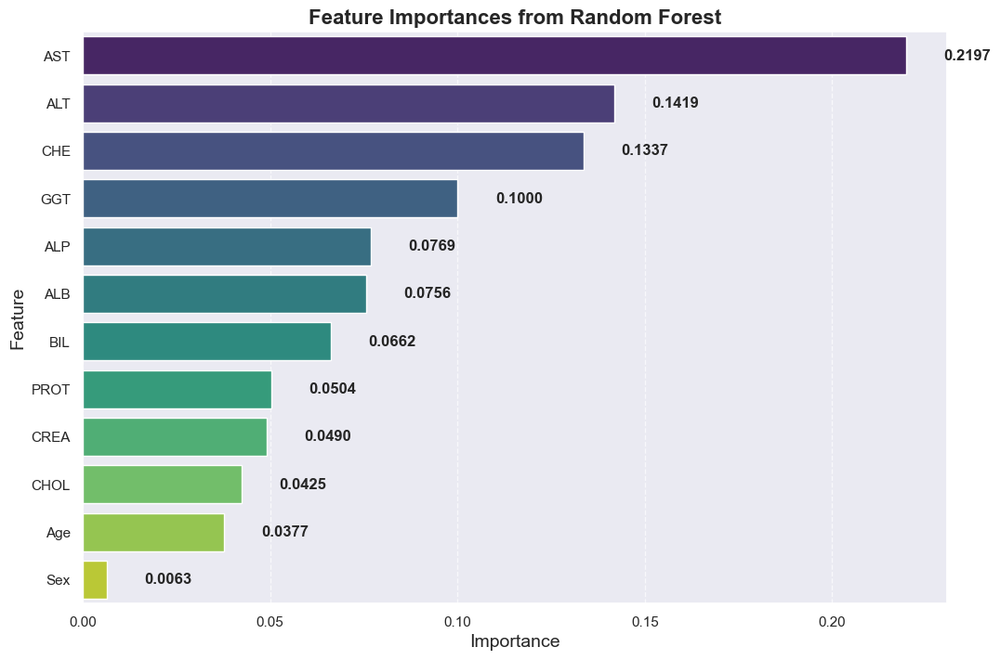
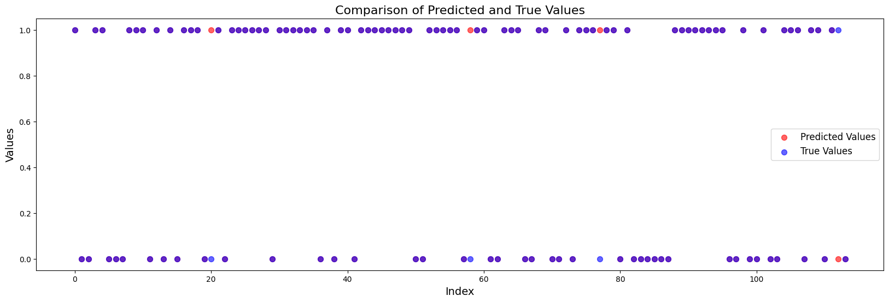
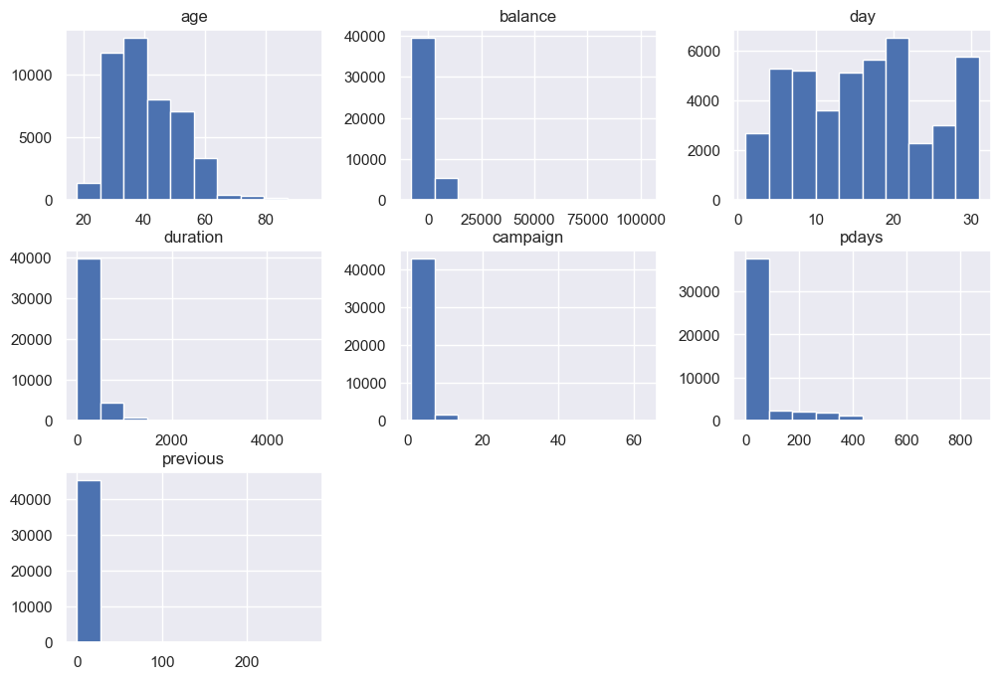
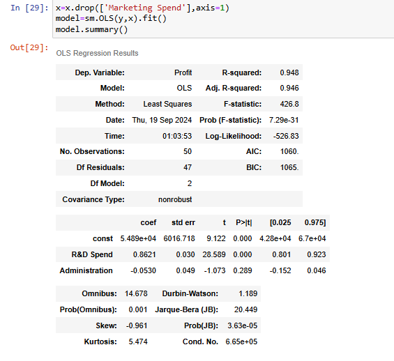

# Farah Elshenawy

_Data Science Enthusiast | Machine Learning Explorer_

## Introduction
I am a data science enthusiast currently studying Computer Engineering at Tanta University. My passion lies in machine learning, predictive modeling, data engineering, and visualization. I am eager to apply my skills and knowledge to solve real-world problems.

## Skills
- **Programming Languages**: Python, SQL
- **Tools & Libraries**: pandas, NumPy, scikit-learn, TensorFlow, Keras, Matplotlib, Seaborn, Plotly
- **Techniques**: Machine Learning, Predictive Modeling, Data Engineering, Data Visualization, Data Analysis

## Education
- **Degree**: Computer Engineering, Tanta University
- **Certifications**: DEPI Data Engineering trainee, Machine Learning with Eng. Yousef

## Projects

### 1. Blood Donor and Cirrhosis Analysis

- **Description**: Analyzes a dataset of blood donors and cirrhosis patients to explore and predict health conditions.
- **Key Role**: Performed data preprocessing, exploratory data analysis (EDA), feature engineering, and machine learning model development.
- **Outcome**: Developed a machine learning model to predict health conditions based on medical data.
- **Repo**: [Blood Donor and Cirrhosis Analysis](https://github.com/FarahElshenawi/blood-donor-cirrhosis-analysis.git)

### 2. Breast Cancer Diagnosis Prediction

- **Description**: Predicts breast cancer diagnosis based on features like cell nuclei radius, texture, and smoothness.
- **Key Role**: Handled data preprocessing, feature engineering, model training, and evaluation using multiple classifiers.
- **Outcome**: Built a classifier model to predict whether a tumor is benign or malignant.
- **Repo**: [Breast Cancer Diagnosis Prediction](https://github.com/FarahElshenawi/Breast_Cancer_Diagnosis_Prediction.git)

### 3. Bank Subscription Prediction

- **Description**: Predicts whether a client will subscribe to a term deposit based on various client attributes.
- **Key Role**: Conducted data cleaning, feature encoding, dimensionality reduction, model building, and evaluation.
- **Outcome**: Created a model to predict term deposit subscription using client data.
- **Repo**: [Bank Subscription Prediction](https://github.com/FarahElshenawi/bank-subscription-prediction.git)

### 4. ML Dimension Reduction (50 Startups)

- **Description**: Applies dimensionality reduction techniques to analyze the impact of R&D spend, administration, marketing, and state on startup profitability.
- **Key Role**: Executed data preprocessing, built regression models, and applied dimensionality reduction techniques.
- **Outcome**: Successfully used statistical models to predict startup profitability based on several features.
- **Repo**: [ML Dimension Reduction (50 Startups)](https://github.com/FarahElshenawi/ml-dimension-reduction-50-startups.git)

## Contact Information
- **LinkedIn**: [LinkedIn Profile](https://www.linkedin.com/in/farah-elshenawy-368bb8218/)
- **Email**: [Email](farah.elshenawy2@gmail.com)

